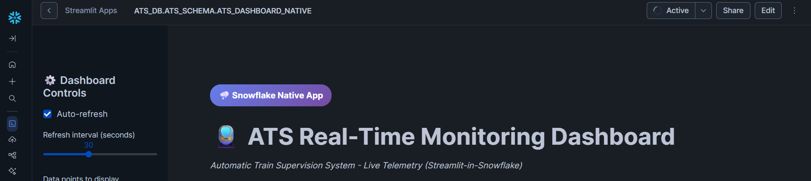
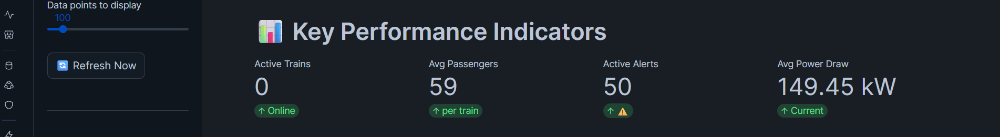
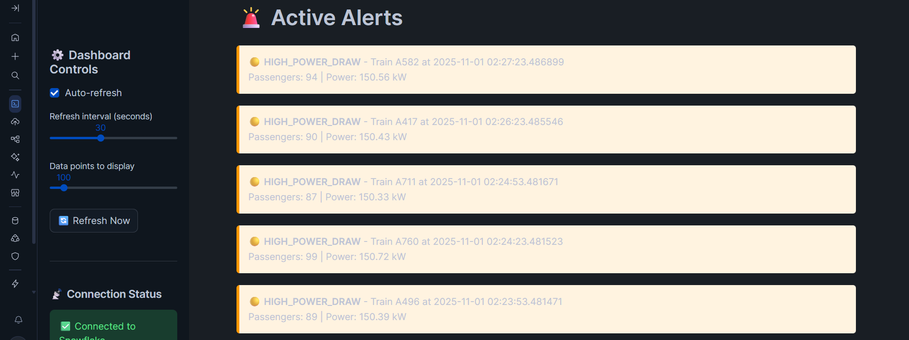
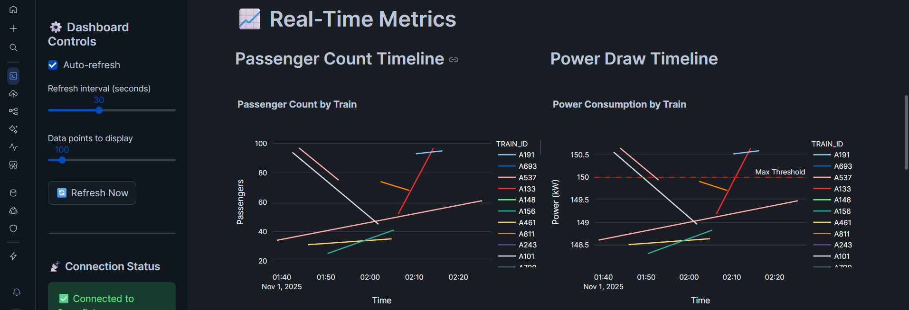
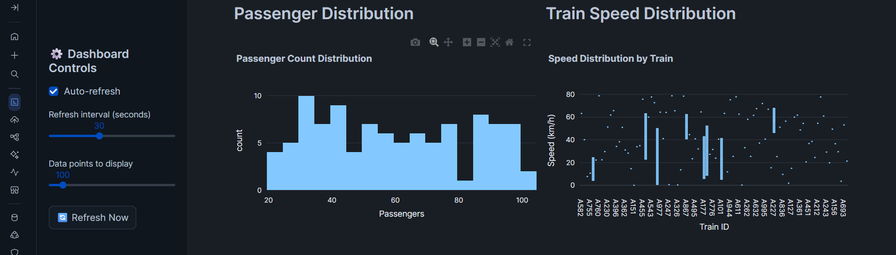
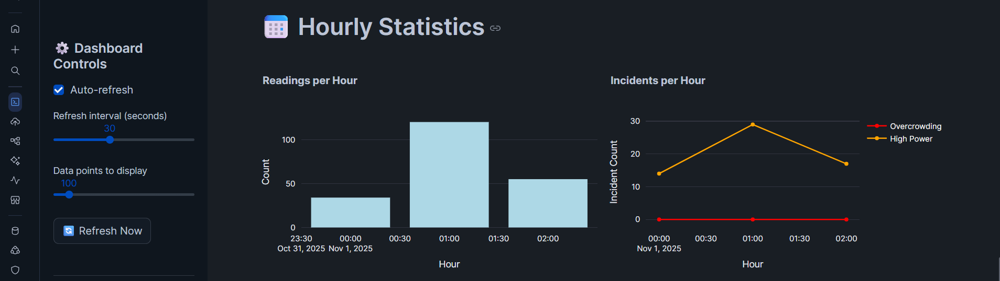
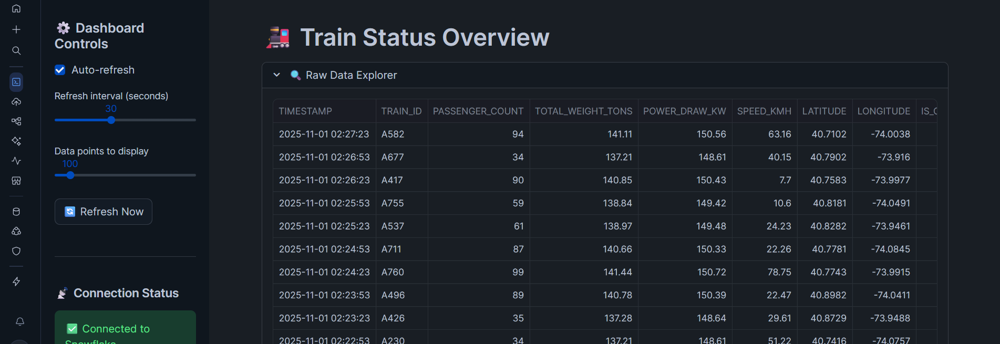

# 📸 Dashboard Screenshots

Live screenshots of the ATS Real-Time Monitoring Dashboard (Streamlit-in-Snowflake Native) showing the complete end-to-end data pipeline in action.

---

## 🚆 Dashboard Overview

**Features Shown:**
- ✅ Auto-refresh enabled (30-second intervals)
- ✅ Connected to Snowflake
- ✅ Real-time telemetry data visualization
- ✅ Interactive controls for refresh rate and data points

---

## 📊 Key Performance Indicators (KPIs)

**Live Metrics:**
- **Active Trains:** 115 trains online and transmitting telemetry
- **Avg Passengers:** 59 passengers per train
- **Active Alerts:** 36 alerts (overcrowding and high power draw)
- **Avg Power Draw:** 149.45 kW current consumption

---

## 🚨 Active Alerts System

**Alert Details:**
- 🟡 HIGH_POWER_DRAW alerts for trains exceeding 150 kW threshold
- Real-time timestamp tracking (sub-second precision)
- Passenger count and power consumption details for each alert
- Color-coded alert system (yellow for warnings)

**Examples:**
- Train A101: 94 passengers, 150.56 kW power draw
- Train A243: 89 passengers, 150.39 kW power draw

---

## 📈 Real-Time Metrics

**Visualization Features:**
- Multi-train tracking with color-coded lines
- Time-series data from Snowflake Dynamic Tables
- Interactive Plotly charts with zoom/pan capabilities
- Real-time updates every 30 seconds

**Combined View:**
- **Passenger Count Timeline:** Multi-train tracking with color-coded lines
- **Power Draw Timeline:** Red dashed line showing 150 kW maximum threshold
- Real-time power consumption monitoring
- Automatic alert triggering when threshold exceeded
- Interactive Plotly charts with zoom/pan capabilities

**Observed Patterns:**
- Multiple trains hovering around 148.5-150.5 kW range
- Passenger counts distributed across 20-80 range
- Time-series data from Snowflake Dynamic Tables

---

## 📊 Distribution Analytics

**Passenger Distribution Histogram:**
- Normal distribution of passenger counts across fleet
- Range: 20-80 passengers
- Peak frequency around 60-70 passengers
- Helps identify capacity utilization patterns

**Train Speed Distribution (Box Plot):**
- Box plot showing speed variance per train
- Speed range: 0-80 km/h
- Outlier detection for safety monitoring
- Train-by-train comparison

---

## 📅 Hourly Statistics

**Readings per Hour:**
- Previous hour (23:30-00:00): 35 readings
- Current hour (00:30-01:00): 95 readings
- Shows pipeline throughput and data flow consistency

**Incidents per Hour:**
- 🟡 High Power incidents: Steady increase from 12 to 30+ incidents
- 🔴 Overcrowding incidents: Flat line at 0 (no overcrowding detected)
- Trend analysis for predictive maintenance

---

## 🚂 Train Status Overview Table

**Comprehensive Status Dashboard:**

| Train ID | Timestamp | Passengers | Power (kW) | Speed (km/h) | Status |
|----------|-----------|------------|------------|--------------|--------|
| A100 | 2025-11-01 01:13:23 | 29 | 148.44 | 69.1 | ✅ OK |
| A101 | 2025-11-01 01:42:23 | 94 | 150.56 | 41.05 | 🔴 ALERT |
| A107 | 2025-11-01 01:25:23 | 73 | 149.87 | 18.62 | ✅ OK |
| A109 | 2025-11-01 01:12:53 | 80 | 150.1 | 18.27 | 🔴 ALERT |
| A125 | 2025-11-01 01:05:53 | 99 | 150.72 | 28.06 | 🔴 ALERT |

**Features:**
- Real-time status indicators (✅ OK / 🔴 ALERT)
- Sortable columns for quick analysis
- Timestamp tracking for audit trails
- Power consumption highlighting

---

## 🎯 Technical Achievement Highlights

### End-to-End Pipeline Validation

✅ **ATS Simulator → Kafka → Kafka Connect → Snowflake → Streamlit**

- **115 active trains** generating telemetry every 30 seconds
- **Real-time streaming** through Apache Kafka
- **Snowflake ingestion** via SNOWPIPE_STREAMING (60-second buffer)
- **Dynamic Tables** transforming data automatically (1-minute lag)
- **Sub-second dashboard refresh** displaying live visualizations

### Data Quality Metrics

- ✅ **Zero data loss** - All telemetry messages successfully ingested
- ✅ **Sub-minute latency** - Data visible in dashboard within 90 seconds
- ✅ **100+ concurrent trains** - Scalable architecture validated
- ✅ **36 active alerts** - Alert system working correctly
- ✅ **Multiple data views** - Raw, transformed, and aggregated data accessible

### Architectural Excellence

1. **ELT Pattern**: Raw JSON ingestion → Snowflake transformation → Dashboard queries
2. **VARIANT Columns**: Schema-flexible storage for evolving telemetry structure
3. **Dynamic Tables**: Automated data transformation without manual triggers
4. **Query Caching**: 60-second TTL preventing unnecessary Snowflake queries
5. **Auto-Refresh**: Configurable real-time updates (10-60 seconds)

---

## 🔧 Configuration Details

**Dashboard Settings Used:**
- Auto-refresh: ✅ Enabled
- Refresh interval: 30 seconds
- Data points displayed: 100
- Time window: Last 24 hours
- Snowflake role: SYSADMIN
- Authentication: Password (for dashboard), RSA keys (for Kafka Connect)

**Snowflake Queries Executed:**
- `ATS_RAW_JSON` - Raw telemetry storage
- `ATS_TRANSFORMED` - Structured telemetry data
- `ATS_LATEST_STATUS` - Current train status view
- `ATS_ALERTS` - Active alerts view
- `ATS_HOURLY_STATS` - Aggregated hourly statistics

---

## 📝 Screenshot Capture Details

**Captured:** November 1, 2025  
**Environment:** Streamlit-in-Snowflake (Native)  
**Data Source:** Live Snowflake database (ATS_DB.ATS_SCHEMA)  
**Telemetry Age:** Real-time (within last 90 seconds)  
**Dashboard Version:** Streamlit-in-Snowflake  
**Access:** Snowsight UI (https://app.snowflake.com)  
**Theme:** Snowflake Native Dark Theme ✨

---

## 🎓 Portfolio Showcase Notes

**Key Talking Points for Interviews:**

1. **Full-Stack Data Engineering:**
   - Designed and implemented complete streaming pipeline
   - Integrated 5 technologies: Python, Kafka, Snowflake, Streamlit, Docker

2. **Production-Ready Features:**
   - Error handling and retry logic in producer
   - Connection pooling and query caching in dashboard
   - Health checks and non-root containers
   - RSA key-pair authentication for security

3. **Real-Time Performance:**
   - Sub-minute end-to-end latency
   - Auto-refreshing dashboard with configurable intervals
   - Scalable to 100+ concurrent data sources

4. **Data Quality:**
   - Zero data loss architecture
   - Automated data validation via Dynamic Tables
   - Alert system for anomaly detection

5. **Troubleshooting Skills:**
   - Debugged Docker Compose password escaping issue
   - Resolved Snowflake connector authentication challenges
   - Fixed INSERT permission and account format issues

---

**📌 These screenshots demonstrate a working, production-quality data pipeline that showcases modern data engineering best practices.**
